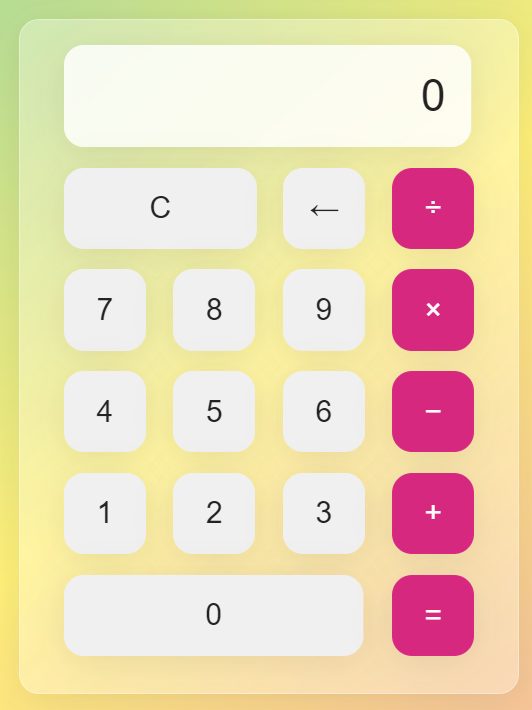

## 📅 EFP-2-SimpleCalculator

Welcome to the second project in my Elementary Front-End Project series! 🚀 
This project, Simple Calculator, is a beginner-friendly web application that 
performs basic arithmetic operations, built using HTML, CSS, and JavaScript. 
No frameworks, no dependencies—just pure vanilla web development!

## 🧾 Project Overview

- This project creates a simple, interactive calculator that performs basic arithmetic operations:

- The calculator supports addition, subtraction, multiplication, and division.

- Users can input two numbers and select one arithmetic operator at a time (e.g., 1 + 2).

- After pressing the = button, the result is displayed on the UI (e.g., 3 for 1 + 2).

- The interface is clean and intuitive, making it easy to use.

- This is a great way to learn about JavaScript event handling, DOM manipulation, and basic HTML/CSS layout while building a practical, real-world tool! ➕➖✖️➗

## 📷 Screenshot

