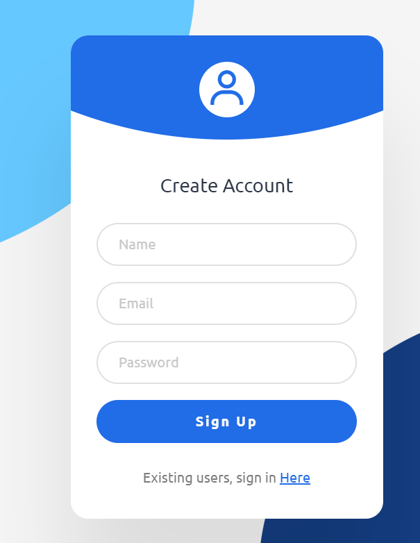

## 📅 EFP-3-SignUpForm
Welcome to my third project in my Elementary Front-End Project series! 🚀
This project, Sign-Up Form, is a beginner-friendly, visually appealing form designed for user registration, built using HTML and CSS. No frameworks, no dependencies—just pure vanilla web development!

## 🧾 Project Overview
`This project creates a sleek, modern sign-up form with a focus on user experience:`

- A centered card layout with a clean white background and vibrant blue accents.

- Dynamic circular background elements for a lively, engaging aesthetic.

- Smooth hover effects and transitions on input fields and buttons for interactivity.

- Powered by CSS, featuring the Ubuntu font and responsive design for all devices.

- A great way to learn about CSS positioning, transitions, and responsive layouts 
while building a practical, real-world component! 🌟📝

- Join the journey and explore the art of crafting intuitive, stylish forms! 

- Follow along to create your own sign-up form and enhance your front-end skills. 🌍

## 📷 Screenshot

